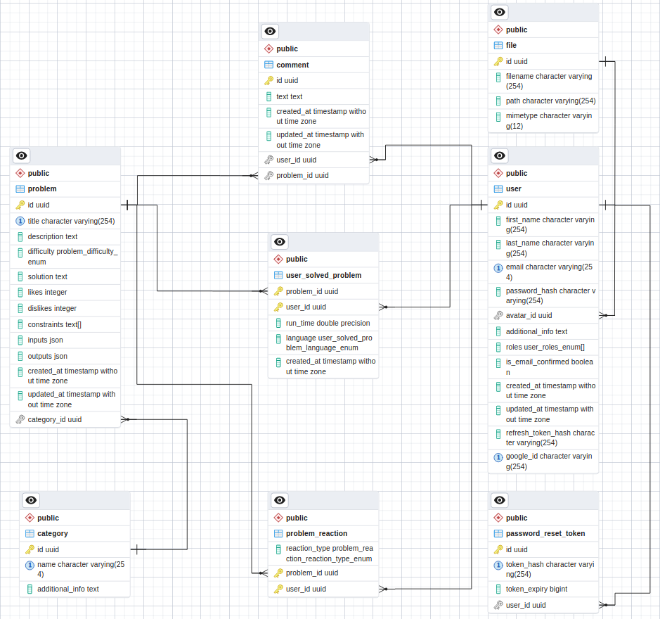

#Mastercode

## Description

In this repository you can see the server side of a Mastercode web application.
**Mastercode** is an educational web platform that pursues the goal of helping programmers become better by solving different problems on the provided "training area" page. You may know similar platforms such as LeetCode, CodeWars, Coderbyte.

##Technologies and libraries used in the project:

- Node.js
- Nest.js
- PostgreSQL
- Redis
- Docker
- Other (TypeOrm, Bull, Passport, Casl, Nodemailer, Pino, Swagger...)

## Physical diagram of the Mastercode database



## Installation

```bash
$ npm install
```

## Running the app

```bash
# development
$ npm run start

# watch mode
$ npm run start:dev

# production mode
$ npm run start:prod
```

## Test

```bash
# unit tests
$ npm run test

# integration tests
$ npm run test:int

# e2e tests
$ npm run test:e2e

# test coverage
$ npm run test:cov
```
