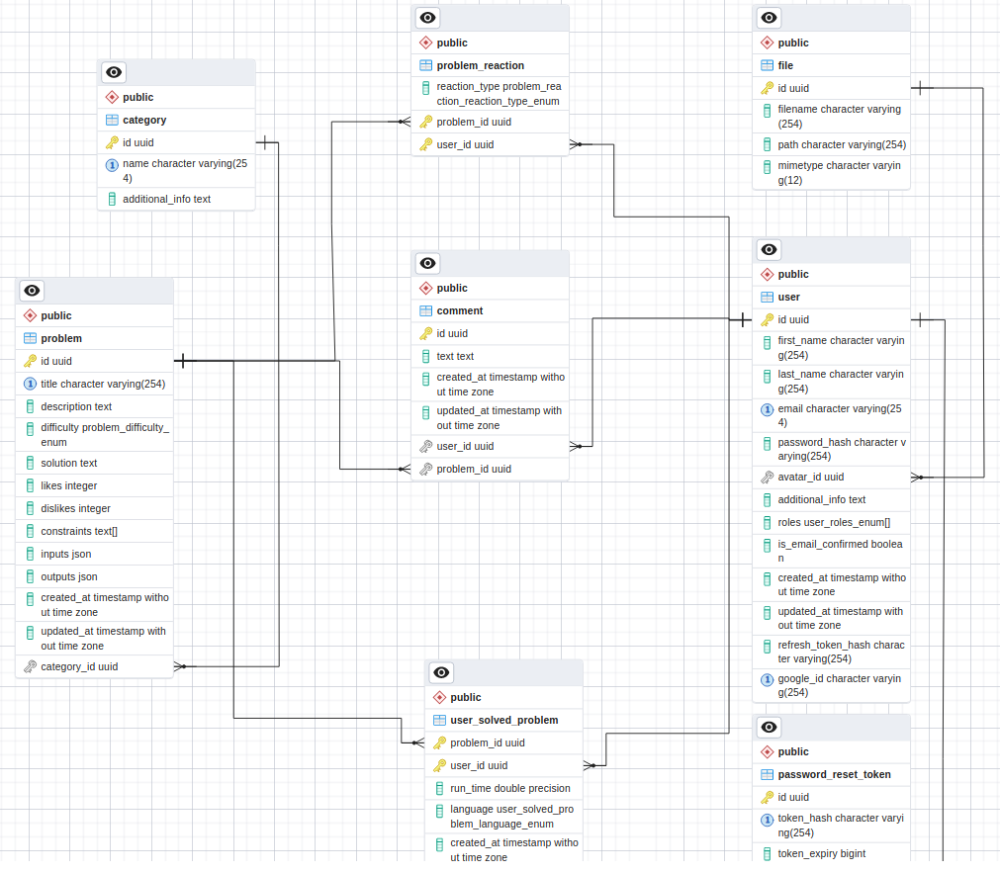

#Mastercode

## Description

You see the server side of a Mastercode web application.
**Mastercode** is an educational web platform that pursues the goal of helping programmers become better by solving different problems on the provided playground page. You may know similar platforms such as LeetCode, CodeWars, etc.
The purpose of creation of the platform was, first of all, a desire to understand how such platforms as LeetCode work under the hood (specifically how they run and test users' code and how they do it securely for servers that host their backend application) and secondly to master common backend developer issues (such as Authentication/Authorization, RBAC/Claim-based authorization, email service integration, convenient errors handling, work with database, caching, testing and so on...).

##Technologies used:

- Node.js
- Nest.js
- PostgreSQL
- Redis
- Docker
- Other (TypeOrm, Bull, Passport, Casl, Swagger...)

## Physical diagram of the Mastercode database



## Installation

```bash
$ npm install
```

## Running the app

```bash
# development
$ npm run start

# watch mode
$ npm run start:dev

# production mode
$ npm run start:prod
```

## Test

```bash
# unit tests
$ npm run test

# e2e tests
$ npm run test:e2e

# test coverage
$ npm run test:cov
```

## License

Mastercode is [MIT licensed](LICENSE).
